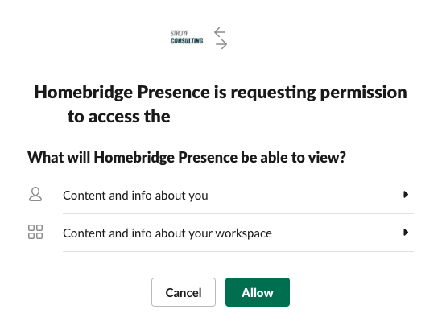
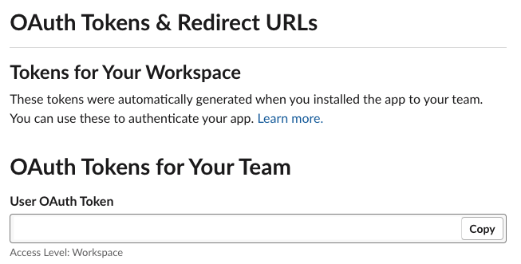
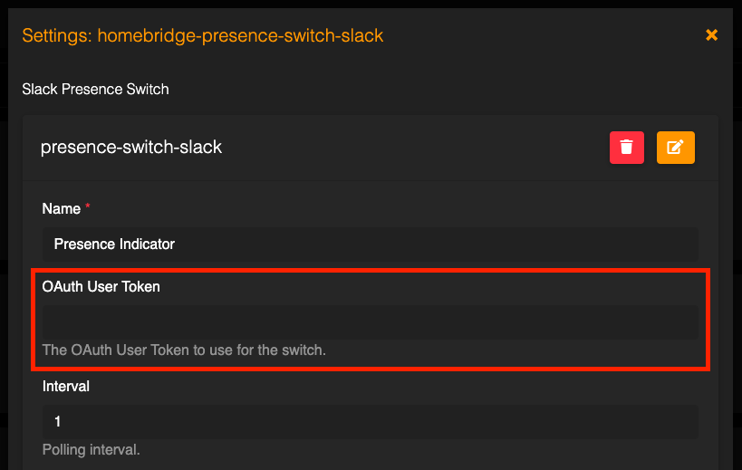
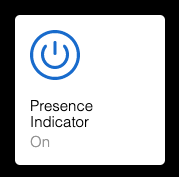

# Homebridge presence switch connected to Slack

[](https://www.npmjs.com/package/homebridge-presence-switch-slack)

This is a fork of the [Homebridge presence switch connected to Microsoft Graph](https://github.com/estruyf/homebridge-presence-switch-msgraph). In this version, the presence is retrieved from the `Slack` APIs.

> **Info**: More information for now can be found here: [https://www.eliostruyf.com/diy-building-busy-light-show-microsoft-teams-presence/](https://www.eliostruyf.com/diy-building-busy-light-show-microsoft-teams-presence/).

The Slack Presence Switch contains the following state switches which you can use in Homekit to automate:

- Available
- Away
- DnD
- Offline
- `<Slack status>`: This can be used to specify custom colors for you own status messages in `Slack`. For instance you can use it to in combination with Google Calendar status in meeting: `In a meeting • Google Calendar`. This status could be useful to show a color when you are busy.

## Installation

In order to make use of the Homebridge Slack Presense Switch, you need to first create an access token for the Homebridge config.

- Start by adding the Slack app to your account.

<a href="https://happeo.slack.com/oauth?client_id=20708274736.1870800114449&scope=&user_scope=users.profile%3Aread%2Cusers%3Aread%2Cdnd%3Aread&redirect_uri=&state=&granular_bot_scope=1&single_channel=0&install_redirect=oauth&tracked=1&team=1"></a>

- Click on `Allow`;



- Copy the generated `User OAuth Token`



- Go to your Homebridge instance
- Go to the plugin section
- Install the `Homebridge Presence Switch Slack` plugin
- Add your `OAuth token` to the following config field



- Save your config and restart the service
- Once the Homebridge service restarted, go to the accessories section, and activate the `Presence Indicator`



## Custom status colors

If you want to add your own custom status colors to show that you are in a meeting for example. You can add the related Slack status message in your config as follows:

```json
{
  ...,

  "statusColors": {
    ...,

    "In a meeting • Google Calendar": {
      "red": 179,
      "green": 0,
      "blue": 0
    }
  }
}
```

> **Info**: each off these status messages you add, will also get a corresponding switch. That way you can add do Homekit automation based on the state of these switches.

## Config

The `accessory` config could look like this:

```json
{
  "accessory": "presence-switch-slack",
  "name": "Slack Presence Indicator",
  "oAuthToken": "<your-token>",
  "interval": 1,
  "setColorApi": "http://127.0.0.1:5000/api/switch",
  "offApi": "http://127.0.0.1:5000/api/off",
  "onApi": "http://127.0.0.1:5000/api/on",
  "startTime": "8:30",
  "endTime": "18:00",
  "weekend": false,
  "statusColors": {
    "available": {
      "red": 0,
      "green": 144,
      "blue": 0
    },
    "away": {
      "red": 255,
      "green": 191,
      "blue": 0
    },
    "donotdisturb": {
      "red": 149,
      "green": 0,
      "blue": 0
    },
    "<slack status>": {
      "red": 179,
      "green": 0,
      "blue": 0
    }
  },
  "lightType": "",
  "debug": true
}
```

## Homekit integration

The following four state switches are available for you to make use of:

- Offline
- Do not disturb
- Away
- Available

These switches can be used in `HomeKit` automation. If you use these, you do not have to set `setColorApi`, `offApi`, and `onApi`. Config could look like this:

```json
{
  "accessory": "presence-switch-slack",
  "name": "Slack Presence Indicator",
  "oAuthToken": "<your-token>",
  "interval": 1,
  "startTime": "8:30",
  "endTime": "18:00",
  "weekend": false
}
```